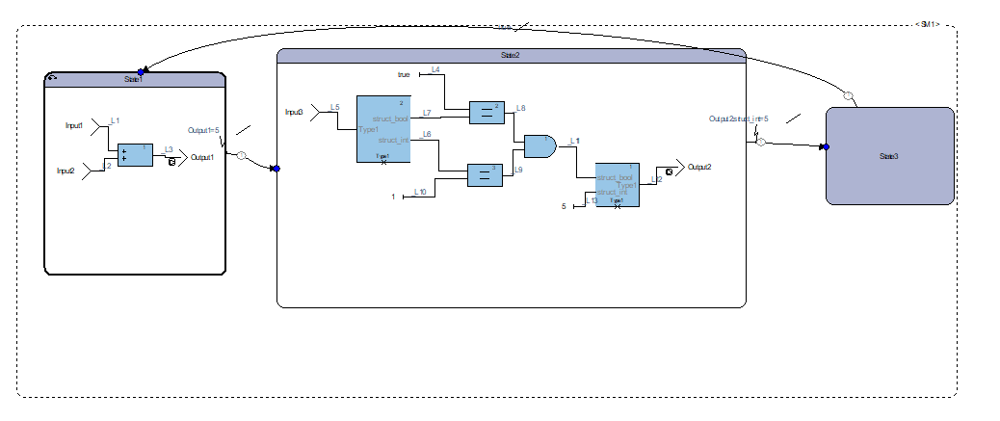
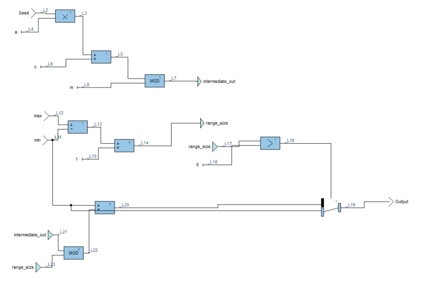
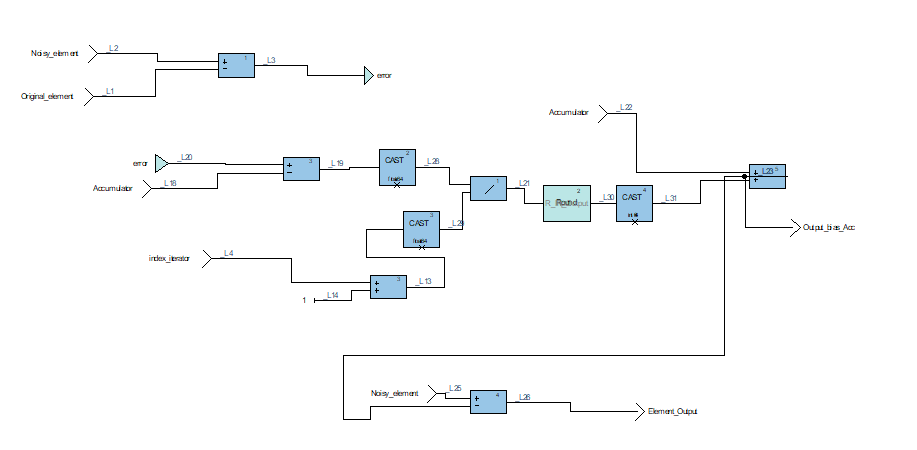
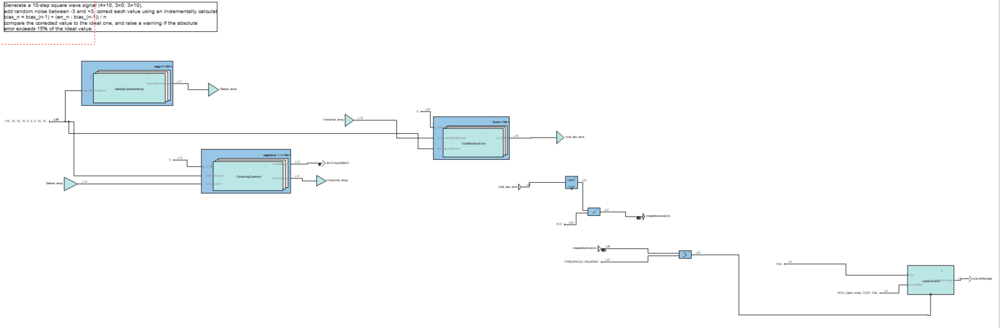
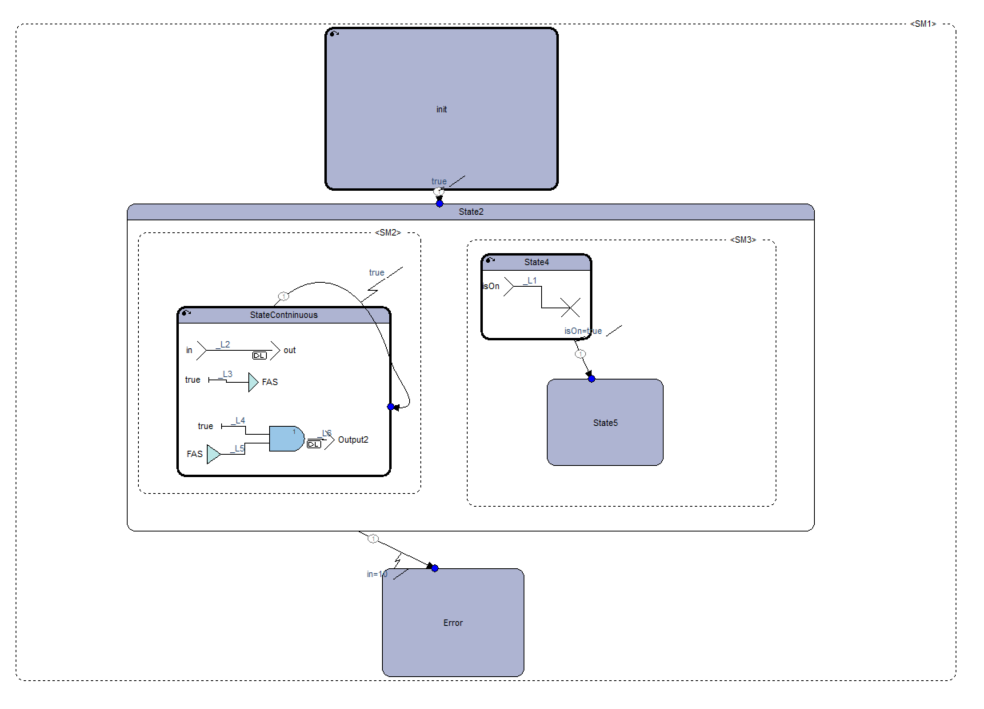

# StateMachineAndMore_DO-178
Developed and validated code and algorithms for the DO-178C avionics standard. These are just some of the huge amount of trials and projects developed
# 1. State Machine integrated in Texas Istrument board + udp protocol
Embedded system that:
- Receives commands via UDP from a Python script.
- Processes them with a State Machine generated by SCADE.
- Returns a mission state via UDP if there are changes.
- Shows debug data via serial port (sciDisplayText).

## 🔄 Architettura di Comunicazione

```plaintext
+-------------------+           UDP           +----------------------+
|   🖥️ Python Sender   | ---------------- -> |   🧠 Embedded Board    |
| (WCU_Trigger_Event) |                      |     (wcu_fas_loop)      |
+-------------------+                        |  - Receive input        |
                                             |  - Execute FSM (SCADE)  |
+-------------------+     UDP se output      |  - Send output          |
| 🖥️ Python Receiver  | <------------------ |  via UdpSend()           |
| (WCU_Mission_Status)|                       +----------------------+
+-------------------+
```


Sent/received data are structures with different msg_id and composed as follows :
typedef struct {
  kcg_int8 Input1;
  kcg_int8 Input2;
  Type1_State_Machine_TI Input3;
} inC_StateMachine_State_Machine_TI;

typedef struct {
  kcg_bool struct_bool;
  kcg_int8 struct_int;
} Type1_State_Machine_TI;

The following image shows the implemented state machine : 
 

 Note : 
- alchogen drivers were used
- the state machine meets the requirements to be do-178c

# 2. Bias-correcting operator of a signal
In this example exercise we went to create an operator whose goal is to correct bias using a cumulative average of the various elements of the value window. Then the average difference of the corrected and original value without bias is calculated, and if it exceeds a threshold the system will warn of the warning.
The generated code is DO-178C certified , has not been covered by testing , but only with simulations and debugging , and is written in C.
The modules of the little project are as follows :
1. **Random Operator** = operator which is used to distort the signal randomly , being deterministic code at the same input will result in the same distortion , by nature of the code itself. The random function implemented is the Linear Congruential Generator
 
2. **Correcting Operator** = Operator that corrects the distorted signal by making it correct using the progressive window average consisting of 10 elements. The signal is corrected using the ideal signal and the distorted signal , one should not use the ideal signal but an estimated error , but this complication was not introduced being a basic example to test the tool

3. **Pipeline Operator** = Pipeline that brings together all the stages , then. Ideal Signal --> Biased signal (Random Operator)--> correction (Correction Operator) --> Total Abs Error with threshold


# 3. Prallel State Machine 
In this state machine , you have 3 states connected by a weak connection , and inside the second state are two state machines running in parallel.
The first one on the left is called by itself , so that it performs continuous checks on the variables.
The second on the right , proceeds in the flow and terminates in the final state.
The hierarchically higher state machine , will go from state 2 to state 3 , only if one of the checks fails in the iterative SM.

